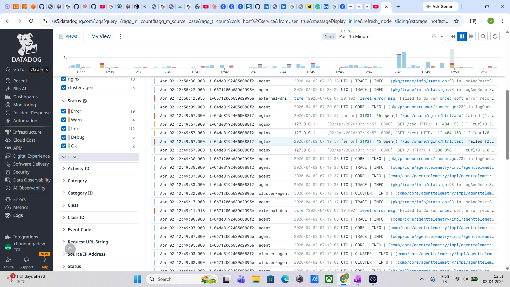

# 🚀 EKS Datadog Monitoring & Observability Project

---

## 📌 Project Overview

This project demonstrates a real-world DevOps monitoring setup using Datadog on AWS EKS.

It covers:

* Kubernetes cluster observability
* Application log collection (NGINX)
* Real-time monitoring using Datadog
* Debugging production-like issues

---

## 🏗️ Architecture

EC2 → EKS Cluster → NGINX Pods → Datadog Agent → Datadog Dashboard

---

## 🛠️ Tech Stack

* AWS EKS
* Kubernetes
* Helm
* Datadog
* NGINX

---

## 🚀 Implementation Steps

1. Configured AWS CLI and connected to EKS cluster
2. Installed Helm
3. Created Datadog namespace and secrets
4. Added Datadog Helm repository
5. Installed Datadog using Helm
6. Verified cluster integration
7. Deployed NGINX application
8. Exposed service using NodePort
9. Generated traffic using curl
10. Verified logs in Datadog

---

## 📊 Monitoring & Logs (Proof)

### NGINX Logs in Datadog

---

## ⚠️ Challenges & Solutions

| Issue                   | Solution                |
| ----------------------- | ----------------------- |
| Helm repo not found     | Added Datadog Helm repo |
| Secret errors           | Fixed syntax            |
| NodePort not accessible | Used port-forward       |
| Logs not visible        | Generated traffic       |

---

## 🎯 Key Achievements

* Implemented Kubernetes monitoring using Datadog
* Collected real-time logs from NGINX pods
* Debugged real DevOps issues
* Used Helm for scalable deployment

---

## 🧠 Key Learnings

* Kubernetes observability
* Helm deployments
* Monitoring and logging strategies
* Troubleshooting in cloud environments

---

## 🧹 Cleanup

helm uninstall datadog-agent -n datadog
kubectl delete deployment nginx
kubectl delete service nginx
kubectl delete namespace datadog

---

## 👨‍💻 Author

Chandan Gadewar

GitHub: https://github.com/Chandangadewar
LinkedIn: https://www.linkedin.com/in/chandan-gadewar-066194258/

---

⭐ If you found this useful, consider giving a star!

